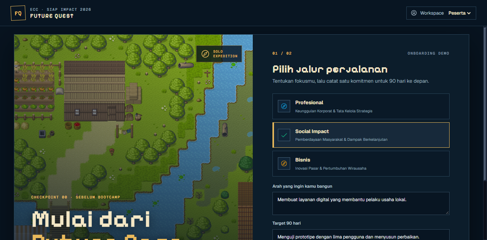
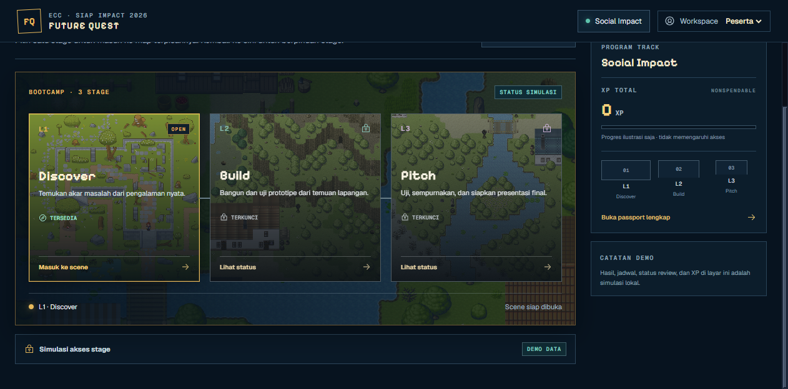
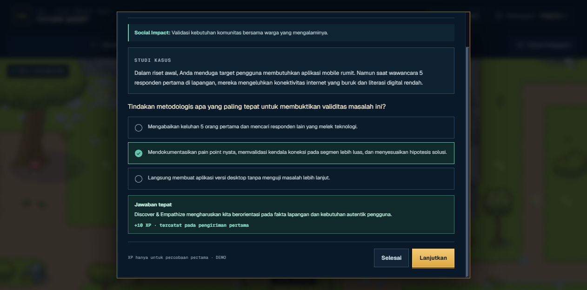
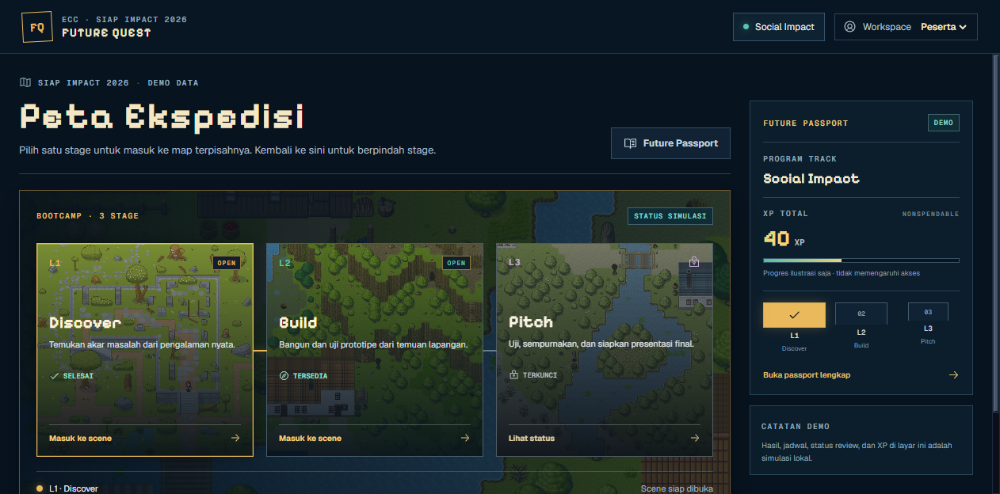
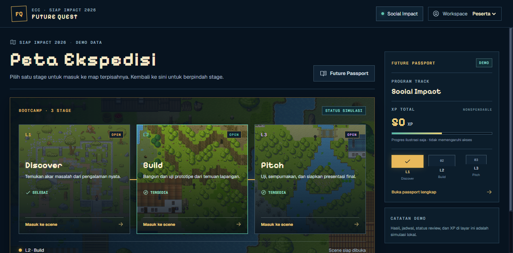
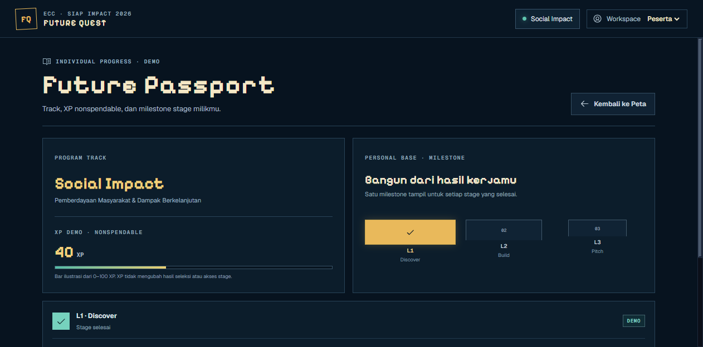

# Post-merge V1 verification

Date: 2026-09-30
Branch: `origin/main` at merge commit `a36e533`
Build: `bun run build` passed after reinstalling dependencies from the frozen lockfile. Vite reports its expected large Phaser chunk warning.
Browser: `agent-browser` against the local app at `http://127.0.0.1:4173`.

## Verified flows

- Future Base onboarding saves the chosen track and opens the Expedition map.
- The map shows L1 available and later stages locked until both the result is published and the scheduled opening has arrived.
- L1, L2, and L3 open as separate scenes, with an explicit Quest board interaction; final-pitch work appears in L3.
- A first valid quiz submission adds 10 XP; repeating the submitted quiz adds no XP.
- A mission can be submitted, returned for revision, resubmitted, and accepted. The accepted L1 mission added 20 XP and the 34/40 evidence-quality score added the 10 XP bonus.
- Future Passport showed the participant track, nonspendable demo XP, and stage milestones.
- A published non-advance result kept prior scenes read-only and locked the next stage.
- Mentor review and Admin Selection Manager workspaces opened and rendered their demo records.
- Browser page errors were empty during the exercised flows.

## Verification limits

The browser's iPhone device profile changed the viewport but retained a fine pointer and zero touch points, so the virtual analog stick could not be exercised as a touch control in this environment. The PR #1 screenshots still contain the before/after UI evidence for the implementation changes; this pass made no UI code changes.

## Screenshots

